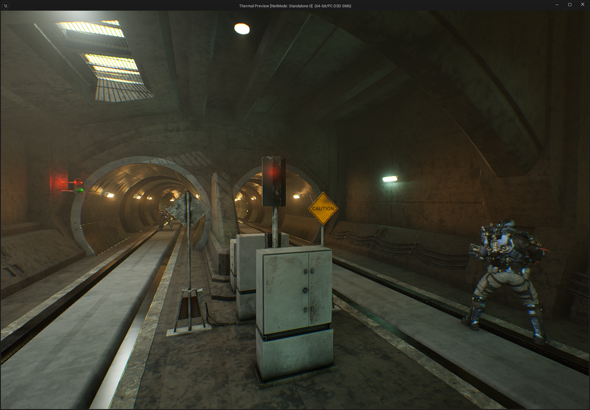
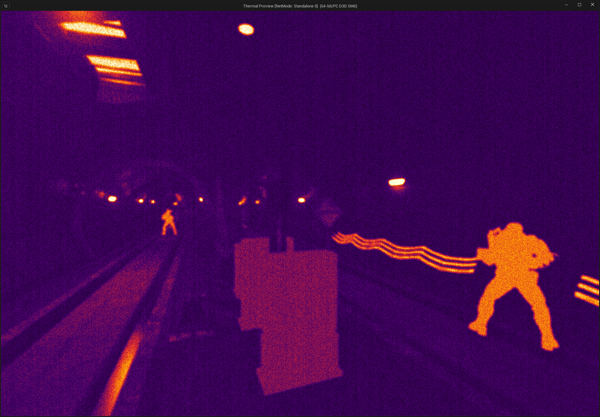
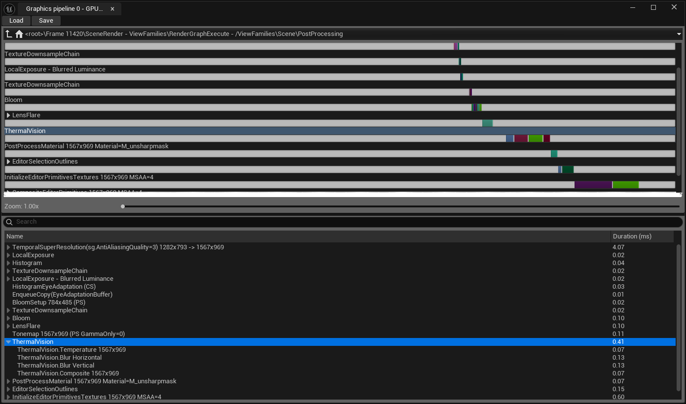

# ThermalVision

A thermal camera post-process for Unreal Engine 5.8, written in C++ against the Render Dependency Graph as a scene view extension. No engine fork, no post-process material, no Blueprint.

**This is a learning project.** I am a graphics engineer and I built this to learn how Unreal's renderer is actually put together: RDG pass construction, scene view extensions, global shaders and the parameter struct system, scene textures, and where a custom pass can legally hook into post processing.

---

## What It Looks Like

Same frame, same camera, one console variable apart. I am using explicit temperatures in the custom stencil buffer: the different figures read flat and hard-edged because a tag is a number, not a measurement. Everything else comes from the luminance: the ceiling lights and lamps clip to white, and the walls and floor get their whole tonal range from how lit they are.

The scene in the images is a subway maintenance tunnel from Fab and is **not** included in this repository. Only the plugin and a minimal test map are.

---

## How It Works

Per frame, the plugin builds a temperature field in degrees Celsius for the whole screen, blurs it the way a lens would, and only then maps it to colour. Temperature is the quantity that travels through the passes; colour happens once, at the end.

Where the temperature of a pixel comes from, in priority order:

1. **Tagged objects.** An actor with *Render CustomDepth Pass* enabled carries its temperature in `CustomDepthStencilValue`. The stencil value *is* the temperature in Celsius. A depth comparison against the scene depth in the same texel means a tagged object hidden behind a wall stays hidden — the effect is a camera, not an X-ray.
3. **Everything else.** Untagged geometry gets an ambient temperature plus a term proportional to scene luminance, so lit surfaces read warmer than surfaces in shadow. It is the piece that makes an untouched scene look plausible without tagging every prop.

### Passes Added

All four run under a single `RDG_EVENT_SCOPE_STAT`, so they group under `ThermalVision` in RenderDoc and in `ProfileGPU`.

`ProfileGPU` at 1567x969: the whole effect costs 0.41 ms, of which the two blur passes are 0.26 ms. TSR in the same frame is 4.07 ms.

| Pass | Type | What it does |
| --- | --- | --- |
| `ThermalVision.Temperature` | Compute | Reads scene colour, custom stencil, custom depth and scene depth; writes raw Celsius to an `R16F` UAV texture |
| `ThermalVision.Blur` (H) | Compute | Applied over the temperature field, horizontal |
| `ThermalVision.Blur` (V) | Compute | The same shader, vertical |
| `ThermalVision.Composite` | Pixel | Sensor noise, normalization, palette, writes the pass output |

The intermediate passes are compute writing to their own UAV textures; the final write is a pixel shader. The blur passes are skipped entirely when the radius is 0: no pass is added to the graph at all, rather than a pass that does nothing.

---

## How to Use

1. Project Settings → Rendering → **Custom Depth-Stencil Pass = Enabled with Stencil**.
2. On any actor you want to give an explicit temperature: enable **Render CustomDepth Pass** and set **CustomDepthStencilValue** to the temperature in degrees Celsius.
3. In the console: `r.ThermalVision.Enable 1`.

### Console Variables

| Variable | Default | Meaning |
| --- | --- | --- |
| `r.ThermalVision.Enable` | `0` | Turns the effect on |
| `r.ThermalVision.AmbientTemperature` | `20` | Celsius for untagged geometry before the luminance term |
| `r.ThermalVision.LuminanceTemperatureGain` | `30` | Degrees added at full scene luminance |
| `r.ThermalVision.SkyTemperature` | `-20` | Celsius for pixels with no geometry |
| `r.ThermalVision.TemperatureMin` | `5` | Celsius mapped to the cold end of the palette |
| `r.ThermalVision.TemperatureMax` | `50` | Celsius mapped to the hot end |
| `r.ThermalVision.BlurRadius` | `3` | Blur radius in pixels, 0 to 8; 0 skips both blur passes |
| `r.ThermalVision.BlurSigma` | `4` | Gaussian standard deviation in pixels |
| `r.ThermalVision.NoiseTemporal` | `4` | Configuration for per-frame grain |
| `r.ThermalVision.NoiseFixedPattern` | `4` | Configuration of the static pattern noise |
